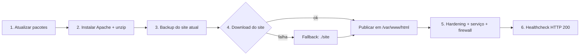

<div align="center">

# 🌐 Linux IaC — Provisionamento Automático de Servidor Web Apache

**Um comando transforma uma VM Linux em um servidor web configurado, protegido e validado.**


</div>

---

## 📌 Visão geral

Projeto do desafio **Infraestrutura como Código** da [DIO](https://www.dio.me): um script que
**provisiona automaticamente um servidor web**. Um servidor web armazena, processa e entrega páginas
aos usuários via HTTP; aqui, todo esse ciclo (instalação, publicação do site, serviço e verificação)
é automatizado e versionado no GitHub.

## ✨ O que o desafio pediu × o que este projeto entrega

| Requisito do desafio | Entrega | Diferencial adicionado |
|---|---|---|
| Atualizar o servidor | ✅ `update` + `upgrade` | `--skip-upgrade` para execuções rápidas |
| Instalar Apache e unzip | ✅ | Suporte a **apt, dnf e yum** (Debian/Ubuntu/RHEL/Rocky/Alma) |
| Baixar a aplicação do GitHub | ✅ repositório `linux-site-dio` | URL configurável (`--site-url`) e **fallback offline** |
| Copiar para `/var/www/html` | ✅ | **Backup automático** do conteúdo anterior + permissões corretas |
| Servidor no ar | ✅ | Serviço habilitado no boot e **healthcheck HTTP 200** |

### 🚀 Melhorias que destacam o projeto

1. **Multi-distro** — detecta `apt`, `dnf` ou `yum` e ajusta pacote, serviço e diretórios.
2. **Idempotente** — reexecutar não quebra nada; o site é reimplantado com segurança.
3. **Backup automático** em `/var/backups/iac-apache/` antes de sobrescrever o site.
4. **Hardening** — `ServerTokens Prod`, `ServerSignature Off`, `TraceEnable Off` e headers `X-Content-Type-Options`, `X-Frame-Options` e `Referrer-Policy`.
5. **Firewall inteligente** — libera a porta 80 em UFW ou firewalld, somente se estiverem ativos.
6. **Fallback offline** — se o download falhar, publica a página local da pasta `site/`.
7. **Healthcheck** — só declara sucesso após receber HTTP 200.
8. **Modo simulação** (`--dry-run`), **logs** em `/var/log/iac-apache.log` e limpeza automática de temporários.
9. **Auditoria** (`validar-servidor.sh`) e **rollback** (`remover-apache.sh`).
10. **CI** com ShellCheck e teste de fumaça (provisiona o Apache no runner do GitHub Actions).

## 🗺️ Arquitetura do pipeline



## 📁 Estrutura do repositório

```text
linux-projeto2-iac/
├── provisionar-apache.sh      # Script principal (IaC)
├── validar-servidor.sh        # Auditoria do servidor
├── remover-apache.sh          # Rollback (restaurar backup / desinstalar)
├── site/index.html            # Página local (fallback offline)
├── docs/
│   ├── GUIA_GITHUB.md         # Passo a passo para publicar
│   └── TEXTO_ENTREGA.md       # Texto de entrega do desafio
├── .github/workflows/shellcheck.yml
├── .gitignore
├── LICENSE
└── README.md
```

## ⚙️ Pré-requisitos

- Linux (Ubuntu, Debian, RHEL, Rocky, Alma...) com acesso à internet
- Privilégios de `root` ou `sudo`
- `git`

## ▶️ Como usar

```bash
git clone https://github.com/Josewagnerbljr-sys/linux-projeto2-iac.git
cd linux-projeto2-iac
chmod +x *.sh

sudo ./provisionar-apache.sh --dry-run     # simula
sudo ./provisionar-apache.sh               # provisiona
sudo ./validar-servidor.sh                 # audita
```

Ao final, o script exibe o endereço para acesso: `http://IP-DA-VM/`.

### Opções

| Opção | Descrição |
|---|---|
| `-u, --site-url URL` | Publica outro site `.zip` (padrão: repositório do desafio) |
| `-l, --local` | Publica a pasta `./site` sem baixar nada |
| `-s, --skip-upgrade` | Pula o upgrade de pacotes |
| `-f, --no-firewall` | Não altera o firewall |
| `-n, --dry-run` | Simula, sem alterar o sistema |
| `-h, --help` | Ajuda |

### Rollback

```bash
sudo ./remover-apache.sh --restaurar   # restaura o último backup do site
sudo ./remover-apache.sh --purgar      # desinstala o Apache
```

## 🧪 Verificações realizadas

| Item | Como foi verificado |
|---|---|
| Sintaxe dos scripts | `bash -n` em todos os arquivos |
| Fluxo completo | `--dry-run` exibe as 6 etapas sem alterar o sistema |
| Instalação real | Smoke test configurado no GitHub Actions (job `smoke`), executado a cada push |
| Servidor no ar | `validar-servidor.sh`: serviço ativo, porta 80, HTTP 200, headers |

## 🔐 Boas práticas de segurança aplicadas

- Versão do Apache e assinatura ocultas; método `TRACE` desabilitado.
- Headers de proteção contra sniffing de conteúdo e clickjacking.
- Permissões do docroot: diretórios `755`, arquivos `644`, dono `root`.
- Firewall alterado apenas quando ativo, liberando somente a porta 80.
- Backup antes de qualquer sobrescrita.

> 💡 Para produção, adicione HTTPS (Let's Encrypt/Certbot) e restrinja o acesso administrativo.

## 🛣️ Roadmap

- [ ] HTTPS automático com Certbot
- [ ] Virtual hosts por domínio
- [ ] Variante Nginx
- [ ] Integração com Ansible/Terraform

## 👨‍💻 Autor

**José Wagner Blanco Júnior** — Principal AI Systems Architect | Executive Manager

- GitHub: [@Josewagnerbljr-sys](https://github.com/Josewagnerbljr-sys)
- LinkedIn: [linkedin.com/in/blancoconsultoria](https://linkedin.com/in/blancoconsultoria)
- E-mail: consultoriablanco8@gmail.com
- DIO: [web.dio.me/users/consultoriablanco8](https://web.dio.me/users/consultoriablanco8)

## 📄 Licença

Distribuído sob a licença MIT. Consulte o arquivo [LICENSE](LICENSE).
